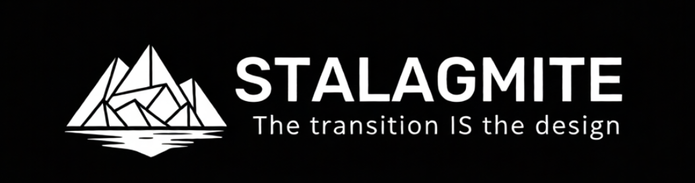

  

**Make stalagmites, not stalactites.** Stalagmites grow from the ground
and stand; stalactites hang and need support. Stalagmite mechanically
enforces that rule on your STL — then tells you how to fix the part, not
where to put the scaffolding.

*The interactive 3D report (`--report`): click a defect, the camera
flies underneath it, and the fix is spelled out with coordinates —
"replace the flat with a ≥45° cone at least 10.1mm tall."*

Start with `HANDOFF.md` for the full story; design principles are in
`DFAM_RULES.md`; the literature behind every threshold is in
`LITERATURE.md`.

**The core rule as one test:** every slice must lie within a
`dz·tan(max_angle)` dilation of the slice below it. This single containment
check subsumes overhang detection, floating features, and unsupported starts.
Slicers paint overhangs red and scaffold around them; this tool exists to
tell you the *design* is wrong, and (eventually) how to fix it.

## Install

    pip install .
    # or manually:
    pip install numpy trimesh shapely networkx scipy

(`networkx` and `scipy` are quiet trimesh requirements — slicing fails
without them.)

## Quick start — no command line needed

    stalagmite-gui

Opens a local page in your browser with three tabs, so the whole toolkit
works without the command line:
- **Audit** — drop an STL, get the full interactive 3D report (open or download it)
- **Orient** — find a better build pose, see the support reduction, download the rotated STL
- **Compare** — drop two revisions, see what your change resolved / introduced

Runs entirely on your machine (localhost); nothing is uploaded.

## Quick start — command line

    # audit any part -- thread helices are detected automatically
    stalagmite part.stl --auto-ex

    # the clean reference part, with manual exclusion zones instead
    python3 dfam_audit.py fixtures/06_clean_final.stl --ex 0:16.5:11 --ex 54:65:13

    # write a copy of the mesh with violating faces painted red
    # (open the .ply in any mesh viewer - MeshLab, f3d, Blender, PrusaSlicer)
    python3 dfam_audit.py part.stl --ex 0:16.5:11 --export part_violations.ply

## Diff two revisions (`stalagmite-diff`)

Iterating on a part? Compare the old and new STL and see exactly what
your change did:

    stalagmite-diff old.stl new.stl --auto-ex

Reports each defect feature as **RESOLVED** (gone), **PERSISTS** (still
there, with any severity change), or **NEW / NEW-FAIL** (introduced), and
a verdict of IMPROVED / REGRESSED / CHANGED / UNCHANGED. Exit code is 1
only if the change *regressed* (introduced or worsened a failure), so you
can gate a parametric-CAD workflow on "my edit didn't break anything." It
assumes both revisions share a coordinate frame (they're iterations of
one part, not re-orientations).

## Automating a "before I ship" gate

Machine-readable output for scripts and CI, three equivalent ways in:

Bash — exit code only (simplest gate):

    stalagmite part.stl --auto-ex || { echo "not printable"; exit 1; }

Exit codes: **0** = printable (PASS / PASS_WITH_LIMITS / REVIEW),
**1** = FAIL, **2** = could not audit (unreadable/empty mesh — with
`--json` this is an `{"status":"ERROR",...}` object, never a traceback).
Treat both 1 and 2 as "do not ship."

Bash — full JSON to log/parse (`--json` prints one object; exit code
unchanged: 0 = PASS/PASS_WITH_LIMITS/REVIEW, 1 = FAIL):

    stalagmite part.stl --auto-ex --json > audit.json
    # audit.json: {status, printable, exit_code, profile, thresholds,
    #   counts:{fail,judge,tolerable}, features:[{class,severity,z,
    #   centroid,ledge_mm|roof_width_mm,repairs}], exclusions,
    #   auto_zones:[{zlo,zhi,rmax,center,step_deg,lobes}], health}

Python — the same dict, plus the live objects:

    import stalagmite
    r = stalagmite.check("part.stl", auto_ex=True)
    if r.failed:
        raise SystemExit(f"{r.status}: " + "; ".join(r.defects()))
    r.to_dict()      # same shape as --json
    r.to_json()

The JSON shape (and `AuditResult.to_dict()`) is the stable contract —
gate and log against those keys.

## Result states

The audit reports one of four truthful states — a deliberate bridge does
not read like an unprintable floating boss:

| state | meaning | exit |
|---|---|---|
| PASS | every layer supported; no concerns | 0 |
| PASS_WITH_LIMITS | prints as-is; only within-allowance ledges / surface notes | 0 |
| REVIEW | printable, but contains judged bridge(s) — eyeball first | 0 |
| FAIL | will not print as oriented; needs a fix or reorient | 1 |

Only FAIL is a nonzero exit, so it's safe in CI while still distinguishing
the printable-but-noteworthy cases in the status line and report.

## Process profiles

There are no universal thresholds: the slice-containment *principle* is
universal, but the *numbers* (overhang angle, bridge span, wall, ledge)
depend on nozzle, layer height, material and machine. Profiles bundle them
under a name, with provenance for each value.

    stalagmite part.stl                              # conservative generic-fdm (default)
    stalagmite part.stl --profile generic-fdm-fine   # 0.2mm-layer variant
    stalagmite part.stl --profile-file myprinter.json  # your calibrated setup
    stalagmite --list-profiles

You never have to pick a printer — the default is a documented, cautious
generic-FDM profile. A named or custom profile just makes the advice
machine-specific. Individual flags (`--angle`, `--dz`, `--ledge-max`,
`--bridge-max`, `--warn-angle`, `--min-wall`) override any profile value.
See `docs/profiles/` for the JSON format.

Flags: `--angle` (default 45), `--dz` layer height (default 0.4mm),
`--ex zlo:zhi:rmax` cylindrical exclusion zone for thread helices
(repeatable), `--export out.ply` colored violation mesh, `--suggest`
parametrized repair suggestions (Tier 3), `--warn-angle 30` surface-
quality lint (prints, but degraded downskin — Saunders' yellow band),
`--min-wall 0.8` thin-feature lint (Hinchy FFF minimum). Lint warnings
never fail the audit.

Bridge features report the **roofed width** measured on the merged
multi-layer region (the physical span being crossed); a roofed width
beyond 10mm escalates the feature to fail severity.

## Interactive 3D report (`--report`)

    stalagmite part.stl --auto-ex --report report.html

One self-contained HTML file, openable in any browser, shareable as a
file, fully offline (three.js is vendored inline). A rotating 3D view
of the part with defect faces coloured by severity, beside a clickable
defect list — selecting a defect flies the camera underneath it (defects
are undersides) and reveals the Tier-3 repair suggestions. The clean
part shows a green PASS.

## Helix auto-detection (`--auto-ex`)

Thread helices legitimately migrate sideways along their flanks and
would otherwise false-positive. `--auto-ex` recognises them from a
first audit pass by their signature — many consecutive layers of small
constant-area lobes whose centroids lie on a circle and advance by a
consistent per-layer angle (the helix pitch) — then excludes the fitted
cylinders and re-audits. Real defects don't share the signature (flat
ledges are single wide layers; boss undersides are mirror-symmetric
pairs; bridges last a couple of layers), and thread-runout ledges just
above a helix are absorbed into its zone with a bounded growth cap.
On the six-fixture regression suite, auto-detection reproduces the
hand-tuned baseline exactly, and prints each zone in `--ex` form for
reuse. New users: see `GETTING_STARTED.md`.

## Tier 3: repair suggestions (`--suggest`)

Each defect feature gets concrete, parametrized fixes rather than "add
supports". Fail-severity features are grounded by a reachability search:
the highest solid a 45° hull can descend onto, reported with coordinates —

    [fail] steep-growth  z 14.3  ledge 8.6mm
        -> morph the transition: replace the flat with a >=45 deg
           chamfer/cone at least 8.6mm tall (the transition IS the shape)
        -> or gusset down to the solid at (-1.3,10.2) z=13.1

Repair taxonomy: ground-it (hull/gusset to nearest solid or bed pillar),
morph the transition, teardrop/diamond the opening, flatten/chamfer,
accept (judged bridge / functional flat per DFAM_RULES #4 and #7), or
reorient (Tier 4). Always re-audit after applying a repair — fixes can
create new overhangs (Adam & Zimmer 2014).

## From telling to doing: sculptable repair geometry

Fail defects don't just get advice — they get **real, adjustable repair
geometry**, built by lofting between contours taken from the actual
audited slices (a hex flange gets a hex-to-neck cone; a rectangular
ledge gets its true rectangular footprint — never an invented
primitive).

In the report, selecting a fail defect shows a translucent green
repair body with three sliders — **Height**, **Easing** (straight
chamfer → concave fillet) and **Flare** — so you sculpt the fix to
taste. Physics is a hard constraint, not a suggestion: the height
slider cannot go below what the profile's angle permits, a live badge
shows the worst slope, and nothing can extend below the build plate.
**Download repair STL** exports your sculpted body, union-ready.

From the CLI: `--emit-fix repairs.stl` writes the default (minimum,
straight-chamfer) bodies for all fail features. Union them into the
part in any CAD, then re-audit — on the regression suite this turns
the worst fixture from FAIL into REVIEW with zero fail features left.

## Repair primitives: the fix must respect the design

The repair generator picks its move from the defect's anchoring, not
one-size-fits-all:

| defect signature | primitive | what it builds |
|---|---|---|
| reachable support below | **loft** | morph down to real support contours |
| nothing below | **pillar** | ground the footprint to the bed |
| flat internal ceiling, anchored all around (bottle-cap roof) | **roof chamfer** | a corbelled cone ring climbing from the wall to the ceiling |

The roof chamfer is the real-world bottle-cap case: a downward loft
would plug the whole cavity and swallow the spigot bore. Instead the
chamfer closes the opening inward layer by layer at the profile angle —
**the cavity stays hollow and bores stay open** (it stops at the bore's
edge). It's exactly what a designer would model by hand: chamfer the
roof into a gentle cone. In the report the part goes x-ray while you
sculpt the funnel; extra small roof holes that the cone may cover are
called out in the notes.

Through-holes survive the chamfer: the main bore bounds the closure,
and every **secondary roof hole (vents!) gets a vertical clearance
shaft drilled through the applied body** — a vent that stops at the
chamfer is not a vent. (True booleans via `manifold3d`, now a
dependency; if drilling ever fails the notes say so honestly instead
of covering the hole silently.)

The chamfer also respects **functional wall geometry**: exclusion zones
(the threads you `--ex`'d or auto-detected) and keep-clear zones on the
opening's wall clamp the chamfer's attachment ABOVE them. If a full
cone no longer fits, a partial closure is used when its residual ledge
stays within allowance — proven by re-audit. If even that doesn't hold,
the automated fix refuses (never-worse) and tells you the truth: this
cap needs its roof raised or its threads shortened — a design change
(`stalagmite-autofix` can search for it if the design is parametric).
The sculptor still shows the flagged partial ghost with a red badge so
you can judge the droop yourself.

Repairs are not only for failures: in the report, **every defect card
is sculptable** — tolerable ledges and judged bridges get a gold
*"Optional quality repair"* panel (same sliders, same STL download) for
when within-allowance still isn't the surface finish you want.
Automation never applies optional repairs; they exist for you.

## Fix it for me: `stalagmite-fix`

The full apply-and-prove loop in one command:

    stalagmite-fix part.stl -o part_fixed.stl --auto-ex

It audits, builds the repair bodies, boolean-unions them into the part
(manifold3d if available, graceful fallbacks otherwise), **re-audits the
result under the same profile**, and issues a matched-feature verdict:

| verdict | meaning |
|---|---|
| VERIFIED | every fail resolved, nothing regressed — proven by re-audit |
| PARTIAL | fails reduced but some remain |
| NOTHING_TO_FIX | no fail defects to begin with |
| NOT_IMPROVED | repairs didn't help — **output withheld** (`--force` to override) |

That last row is the never-worse guarantee: stalagmite will not hand you
a "fixed" file that audits worse than what you gave it. `--height /
--easing / --flare` shape the repairs (same parameters as the report's
sculptor), `--report fixed.html` writes an interactive report of the
fixed part, `--json` emits the machine object, and exit codes follow the
audit contract (0 printable / 1 still failing / 2 error).

In the GUI, the report view has an **Auto-fix & re-audit** button: one
click swaps in the fixed part's report with a verdict banner and a
Download-fixed-STL button. Python: `stalagmite.fix(part)` returns the
same result object (`.verdict`, `.mesh_fixed`, `.write(path)`,
`.to_dict()`).

On the regression suite: the worst fixture goes FAIL → REVIEW,
0 fail features, `FIX: VERIFIED` — the tool repairs the part and proves
its own repair.

## Fix the design, not the mesh: `stalagmite-autofix`

`stalagmite-fix` welds repair geometry onto a finished mesh.
`stalagmite-autofix` goes one level up: hand it your **parametric build
function** and the knobs you're willing to move, and it searches for the
*smallest* move away from your intended design that makes the part
printable — every candidate is rebuilt from source and fully audited.

A design file is plain Python (CadQuery, trimesh, whatever
`stalagmite.check` accepts):

    PARAMS  = {"shelf_len": (3.0, 10.0), "gusset": (0.0, 1.0)}
    NOMINAL = {"shelf_len": 10.0, "gusset": 0.0}   # what you *wanted*

    def build(shelf_len, gusset):
        return make_my_part(...)                   # CadQuery or trimesh

    # then:
    stalagmite-autofix my_design.py -o best.stl --budget 32

Search = the same numpy-only GP Bayesian optimisation as the orientation
solver, followed by a **homing pass** that pulls each parameter
individually back toward its nominal value, shaving off every bit of
design change the physics doesn't actually demand. The winner is rebuilt
fresh and re-audited before anything is written.

| verdict | meaning |
|---|---|
| NOTHING_TO_DO | your nominal design already audits printable |
| FOUND | a printable parameter set located and proven — the moves are listed |
| NONE_FOUND | nothing printable in the box — **output withheld** (`--force` to override) |

Output tells you exactly what moved and how far
(`shelf_len: 10 → 7.6 (−2.4)`, `design moved 0.57` on a 0–1 scale).
Python: `stalagmite.autofix(build, PARAMS, NOMINAL)` returns the same
result object. Try it: `stalagmite-autofix examples/autofix_demo.py` — a
design whose parameter box contains a trap (shrinking the shelf can
never fix it; the search has to discover the gusset).

## Design-intent tags: `--keep`

An exclusion zone (`--ex`) says *"ignore violations here — I know
better"* (thread helices). A keep-clear zone says the opposite: *"this
region is functional — a seal face, a bore, a mating surface — and no
generated repair may touch it."* Same cylinder syntax:

    stalagmite part.stl --keep 25:33:6:17.4:0        # zlo:zhi:rmax[:cx:cy]
    stalagmite-fix part.stl --keep 25:33:6:17.4:0 -o fixed.stl

The audit flags any defect sitting on a tagged surface
(`[ON KEEP-CLEAR ZONE]` in text, `intent_hits` in JSON, a purple badge
in the report) — so you know a defect is on functional geometry *before*
deciding how to fix it. `stalagmite-fix` then honours the tag twice:
anchor walk-downs skip landings on tagged material, and any repair body
that would still poke into a zone is **dropped with a note** instead of
welded onto your seal face. If that leaves a fail unfixed, the verdict
says so honestly (PARTIAL / NOT_IMPROVED) — intent never silently
degrades the audit's truthfulness.

**In the GUI there are no coordinates at all.** Run an audit, and
every defect card in the report gets a **protect** toggle. Click it and
that defect's own geometry becomes the keep-clear zone; the viewer bar
confirms *"1 defect(s) protected — Auto-fix will keep clear"*, and
Auto-fix reports any withheld repairs right in the verdict banner
(*"1 repair(s) withheld (protected)"*).

From Python, intent can live next to the design instead of in flags —
including straight from CadQuery named faces:

    zone = stalagmite.keep_zone(part.faces(">Z"), pad=1)   # the gland seat
    stalagmite.fix(part, keep=[zone]).write("fixed.stl")

`keep_zone()` also accepts a trimesh, an (n,3) point array, or explicit
bounds.

## Tier 2: violation classification

Every violation is classified by in-plane anchoring and given a severity
(thresholds are literature-sourced, see `LITERATURE.md`, and boundary-
condition dependent — treat them as defaults, not physics constants):

| class | meaning | severity |
|---|---|---|
| starts-in-air | new body appears with nothing below | fail |
| island | unsupported below AND unattached in-plane | fail |
| steep-growth | cantilever ledge, one-sided anchor | tolerable ≤1.8mm (Adam & Zimmer 2014), else fail |
| bridge | anchored on opposing sides | judge ≤10mm free span (Hinchy 2019), else fail |

Per-slice violations are aggregated into physical *defect features*
(consecutive layers, overlapping regions), so a six-fixture regression
part reports "1 defect: judged bridge" instead of three slice records.
The colored export encodes severity: red = fail, orange = judged bridge,
gold = tolerable ledge. Bridges are still reported **for human judgment**
— a deliberate design choice (see `DFAM_RULES.md` #7 and #10); note the
per-layer free-span figure measures corbelling steps, which understates
the physical hole diameter being roofed.

## Tier 4: orientation solver (`dfam_orient.py`)

Searches build poses minimising support volume *subject to what the part
is for* — the constraints plain auto-orienters don't know:

    # thread must stay vertical; helix zones excluded from the proxy
    python3 dfam_orient.py part.stl --axis-vertical 0,0,1 \
        --ex 0:16.5:11 --ex 54:65:13 --save oriented.stl

    # a seal face must print as the floor
    python3 dfam_orient.py part.stl --face 0,0,1:floor

Selecting a defect in the report also draws its **transition diagram** —
a 2D cross-section showing the supporting slice below, the allowed 45°
envelope grown from it, this slice, and the material poking past the
envelope in red. It shows *why* the feature fails and what shape would
have been allowed, not just which facets are wrong. For fail features it
adds a one-line fix: morph the red back within the dashed envelope (the
envelope outline is the exact allowed shape for that cross-section), or
ground it to the solid below.

Face modes: `floor` (normal ends up facing down), `up`, `wall`
(vertical), `not-down` (never support-scarred). Search is Gaussian-
process Bayesian optimisation (Matérn 5/2, LCB), ~35 evaluations, after
Goguelin, Dhokia & Flynn 2021; the objective is their support-ray-length
proxy plus heavily weighted constraint penalties (15° of violation ≈ the
worst-case support cost).

**The proxy proposes, the audit disposes.** By default the solver then
re-ranks its 3 best distinct poses with the FULL containment audit
(`--verify-top K`, 0 to disable): the winner is the pose with the fewest
fail features, then fewest judged bridges, then the proxy score — so a
pose that merely *looks* cheap to support can't beat one that actually
passes physics. Exclusion zones are remapped into each pose's build
frame when the pose keeps their axis vertical; tilted-axis poses are
audited without them (conservative) and say so. The chosen pose's audit
evidence rides along in the result (`chosen_by`, `audit`, `verified`).

## Python API — `import stalagmite`

One call audits a part and hands back a result. It accepts a **CadQuery
object, an STL/OBJ/PLY/3MF path, a trimesh, or a (vertices, faces) pair**:

    import stalagmite

    r = stalagmite.check(part, auto_ex=True)   # part = any of the above
    print(r.status)          # PASS / PASS_WITH_LIMITS / REVIEW / FAIL
    print(r.printable)       # True unless FAIL
    for d in r.defects():
        print(d)
    if r.failed:
        r.write_report("audit.html")
    exit(r.exit_code)        # 0 printable, 1 FAIL -- gate a CI/build step

### CadQuery: the design loop in code

Because a CadQuery model is a Python object, stalagmite audits it directly
— no STL export, no round-trip. Build → audit → tweak a parameter →
re-audit, all in one script:

    import cadquery as cq, stalagmite
    part = make_bracket(gusset=False)
    if stalagmite.check(part).failed:
        part = make_bracket(gusset=True)      # change a parameter
    stalagmite.check(part).write_report("ok.html")

See `examples/cadquery_demo.py` for a runnable version that lets the audit
*drive* the fix — sweeping a taper parameter until the part prints
(`pip install stalagmite[cadquery]`).

### Lower-level

    import trimesh
    from dfam_audit import audit_mesh, export_colored
    mesh = trimesh.load("part.stl", force="mesh")
    bed_area, violations = audit_mesh(mesh, max_angle=45, dz=0.4,
                                      exclude=[(0, 16.5, 11)])
    export_colored(mesh, violations, 0.4, "part_violations.ply")

## Robustness

`load_mesh()` sanitises input (drops infinite/NaN coords and degenerate/
duplicate faces, merges coincident vertices, concatenates scenes, and
auto-flips inside-out meshes) and `mesh_health()` caveats non-watertight
meshes, inconsistent winding, suspicious units, and very high slice
counts — so real-world and messy STLs are audited without crashing, with
an honest note about how much to trust the result. A dedicated torture
battery (`test_robustness.py`) keeps it that way: open meshes, inverted
normals, NaN/inf vertices, self-intersections, disconnected shells,
zero-height plates, garbage files, ASCII STLs and 20k-face organics all
either audit cleanly or fail with a clear error (exit 2), never a
traceback.

## Tests

    pip install pytest
    python3 -m pytest test_fixtures.py

The six STLs in `fixtures/` are the genuine failure history of one real part
(a threaded pH-probe holder, v2→v7) with known defects — the regression
baseline any refactor must reproduce. See `fixtures/FIXTURES.md`.

## License

MIT
